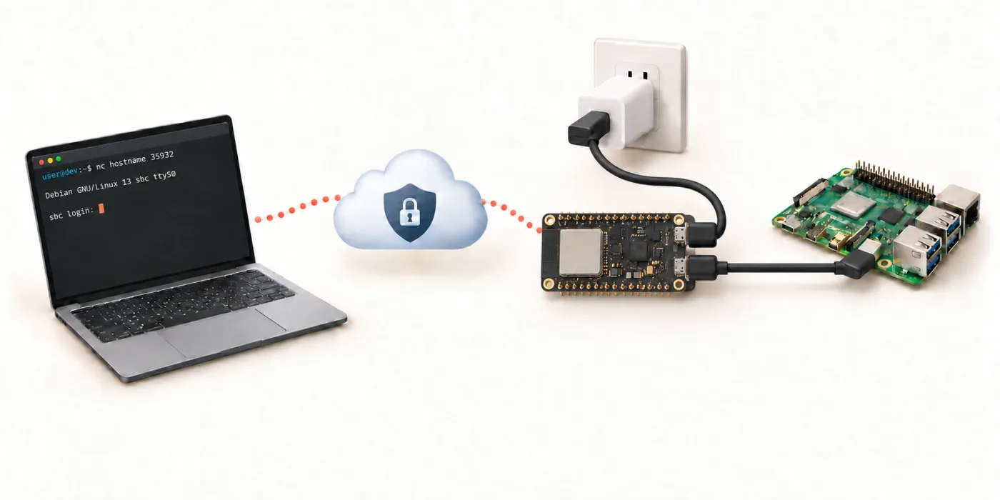

# usb-serial-over-tailscale

[English](README.md)

PSRAM 付きの ESP32-S3 単体で Tailnet に参加し、対象 SBC の USB シリアルコンソールを Tailnet 上の TCP ポートに中継するアダプタである。



```text
Remote PC ──Tailscale / TCP:35932──▶ ESP32-S3 ──USB host──▶ 対象 SBC のシリアルコンソール
```

Tailscale のノードとして必要な機能（制御プロトコル、WireGuard、DERP、NAT 越え）は Rust で独自に実装している。
初期設定は USB シリアル上の対話シェルで行い、書き込みと設定はブラウザだけで完了する。

## 対応状況

実機で確認済みのものは次のとおりである。

- ウィザードによる Wi-Fi 設定と、承認 URL 方式での Tailnet 参加。
- 別ノードからの `tailscale ping`（DERP 経由と直接経路）。
- Raspberry Pi Debug Probe（CDC-ACM）と Toradex Dahlia（FT4232H）のコンソール操作。
- アダプタ再起動、Wi-Fi 再接続、USB 抜き差しからの復帰。

未確認のものは次のとおりである。

- auth key による headless 登録。
- CP210x、CH340/CH341、FT232R など H シリーズ以外の FTDI。
- 対象 SBC 自体の再起動、インターネット断、control サーバ到達不能からの復帰。
- 長時間運用、鍵期限切れ（既定 180 日）後の挙動、Task WDT による再起動。

### モジュールの型番

flash の容量と PSRAM の方式はビルド時の固定設定なので、CI は ESP32-S3 モジュールの型番ごとにイメージを作る（`firmware/variants/`）。
PSRAM は必須である。ネットワーク系スレッドのスタックと TLS のバッファを PSRAM に置いている。

| 型番 | flash | PSRAM | パーティション表 | 状況 |
| --- | --- | --- | --- | --- |
| N16R8 | 16 MB | 8 MB Octal | `partitions.csv`（アプリ 6 MB） | 実機確認済み |
| N8R8 | 8 MB | 8 MB Octal | `partitions.csv` | ビルドのみ、未確認 |
| N4R8 | 4 MB | 8 MB Octal | `partitions-4m.csv`（アプリ 3 MB） | ビルドのみ、未確認 |
| N16R2、N8R2、N4R2 | 16、8、4 MB | 2 MB Quad | 上と同じ | ビルドのみ、未確認 |
| WROOM-2 N16R8V、N32R8V | 16、32 MB Octal | 8 MB Octal | `partitions.csv` | ビルドのみ、未確認 |
| N4、N8、N16（PSRAM なし） | | なし | | 非対応 |

WROOM-1U（外部アンテナ）は WROOM-1 と同じ型番を使う。MINI-1 の N4R2 は `n4r2` に相当する。

手元で型番を指定してビルドするには、esp-idf-sys に型番の defaults ファイルを渡し、イメージ作成スクリプトにも型番を渡す。

```bash
cd firmware
ESP_IDF_SDKCONFIG_DEFAULTS="sdkconfig.defaults;variants/n8r2.defaults" cargo build --release
tools/mkimage.sh n8r2 release
```

## 構成

| パス | 役割 |
| --- | --- |
| `crates/tsnode` | Tailscale ノード実装。制御プレーン（ts2021 Noise と最小の HTTP/2）、WireGuard、DERP、disco、STUN、smoltcp による TCP 終端。ホストでも ESP-IDF でも動く。 |
| `crates/adapter-core` | 対話式セットアップシェル。入出力とデバイス操作を trait で抽象化し、ウィザードをホストで単体テストする。 |
| `tools/hostnode` | tsnode を Linux で動かす検証ツール。実 Tailnet に参加して echo サーバを公開する。 |
| `firmware` | ESP32-S3 ファームウェア（esp-idf-svc）。設定コンソール、USB ホスト（CDC-ACM、FTDI、CP210x、CH34x）、Wi-Fi、Tailscale ノード、TCP ブリッジ。 |

tsnode の内部は次のモジュールに分かれる。

| モジュール | 内容 |
| --- | --- |
| `controlbase`、`h2`、`control` | `/key` の取得、`POST /ts2021` による Noise IK ハンドシェイク、HTTP/2 での `/machine/register` と `/machine/map`。`/key` は常に TLS、Noise 経路は :80 の平文を試してから TLS に切り替える。 |
| `wireguard` | Noise IKpsk2 ハンドシェイク（initiator と responder）、transport、replay window、rekey と keepalive のタイマ。 |
| `derp` | DERP リレークライアント（TLS、fast-start、ping と pong、NotePreferred）。 |
| `disco`、`stun` | 直接経路のための ping、pong、call-me-maybe と、STUN による公開エンドポイントの検出。 |
| `magicsock` | UDP 直接経路と DERP 経路の選択、ハンドシェイクの処理、ピア表の管理。 |
| `netstack` | smoltcp による Tailnet アドレス上の TCP 終端。 |
| `node` | 上記をスレッドで束ねる。鍵は NVS またはファイルに永続化する。 |

## 使い方

### ボードを準備する（はんだ付けが要る）

PSRAM 付きで USB-C が 2 つ（COM と native USB）ある ESP32-S3 ボードを使う。
裏面の `USB-OTG` パッドをはんだで短絡する（下の写真は短絡前）。


これは必須で、ボードから対象の USB ポートへ 5 V を送るためのものである。短絡しないと対象のチップに電源が入らず、検出されない。
2 つのポートの役割は固定である。**`COM` = 5 V の給電**（充電器か PC）、**`USB` = SBC**（対象のデバッグ用 USB ポート）。書き込みと設定のときだけ、`USB` を PC につなぐ。
短絡に伴う注意は後述の「給電と配線」にある。

### ブラウザから書き込む

Chrome か Edge で [signal-slot.github.io/usb-serial-over-tailscale](https://signal-slot.github.io/usb-serial-over-tailscale/) を開くと、ソフトウェアを何も入れずに書き込みと初期設定ができる。
ページは WebSerial でボードの USB Serial/JTAG ポートを開き、ESP Web Tools（esptool-js）で CI がビルドしたバイナリを書く。
同じページの端末でセットアップウィザードも操作できる。
Windows 10 以降、macOS、Linux、ChromeOS で動き、Firefox と Safari とスマートフォンでは動かない。
つなぐのは native 側の USB で、COM 側（CH343）は Windows でドライバが要るので使わない。

ページではモジュールの金属カバーの刻印（`ESP32-S3-WROOM-1-N16R8` など）から型番を選ぶ。
CI（GitHub Actions）は push のたびに全型番をビルドし、`v*` タグでは Release にも `usb-serial-over-tailscale-<型番>.bin`（bootloader、パーティション表、アプリを結合した 1 本）を添付する。
結合したものは `esptool write_flash 0x0` で書けるが、NVS の領域も 0xFF で上書きするので設定と登録が消える。
ページからの更新は 3 つの領域だけを書くので設定は残る。

### 初期設定

未設定の状態で native USB ポートを PC に挿すと、USB シリアル（Espressif USB JTAG/serial、303a:1001）として見える。
ターミナルで開いて Enter を押すと、ウィザードが始まる。

```bash
screen /dev/ttyACM0 115200
```

```text
usb-serial-over-tailscale 0.1.0 - setup mode
Press Enter to start setup, or type a command:
=== Setup ===
Scanning Wi-Fi...
   1) home-wifi        (-48 dBm)
Select network number, or type an SSID (Enter to rescan, q to quit): 1
Password for home-wifi: ********
Connected (192.168.1.42)
Hostname on the tailnet [target-console]:
Registering with Tailscale... (press q to stop waiting)
Open this URL in a browser to approve the device:
  https://login.tailscale.com/a/xxxxxxxx
Waiting for approval...
Tailscale is up: target-console.example.ts.net 100.x.y.z
Setup complete. Reboot into normal mode now? [Y/n]
```

`setup` は hostname と Tailscale の登録が済んでいれば Wi-Fi の追加だけで終わる。
すべてやり直すには `setup all` を使う。
auth key を使う場合は `authkey tskey-auth-...` を打ってから `login` する。

主なコマンドは次のとおりである。
一覧は `help` で出る。

| コマンド | 内容 |
| --- | --- |
| `wifi <ssid> <pw>` | Wi-Fi を追加して接続する。複数登録でき、起動時と再接続時に一番強い既知の AP を選ぶ。 |
| `wifi list`、`wifi forget <ssid>` | 登録済み Wi-Fi の一覧と削除。 |
| `usbif <n>` | 対象の USB インターフェース番号。Raspberry Pi Debug Probe の UART は 1、Toradex Dahlia の Verdin コンソールは 3。 |
| `usbdrv <auto\|cdc\|ftdi\|cp210x\|ch34x>` | USB シリアル変換チップの指定。既定は VID と PID による自動判別。 |
| `port <n>`、`baud <rate>` | ブリッジの TCP ポート（既定 35932。E=3、S=5、P=9 で「ESP32」）と対象のボーレート（既定 115200）。 |
| `status`、`reset`、`reboot` | 状態表示、設定と鍵の消去、再起動。 |

同じシェルは UART ポート（115200 bps、ログと共用）でも常時使える。
Enter を押すとプロンプトが出る。
BOOT を押しながら起動すると、再びセットアップモードになる。

### 接続

Tailnet 上の任意の端末から、hostname か Tailnet アドレスの 35932 番に生の TCP でつなぐ。

```bash
socat -,rawer,escape=0x1d TCP:target-console:35932   # Ctrl-] で抜ける
nc target-console 35932
```

同時に使えるのは 1 接続である。
使用中に届いた 2 本目の接続には `busy` と応答して切断する。
応答のない相手は 120 秒で切り、次の接続を受け付ける。
バイト列はそのまま双方向に流れ、プロトコルの付加はない。
ボーレートはアダプタ側の設定で決まり、クライアントからは変えられない。

### 給電と配線

給電は COM 側の USB から行う。
PC でも USB 充電器でも構わない。
native 側は USB ホストとして対象につなぐポートで、対象のデバッグポートから電源は来ない前提である。

native 側から 5 V を出すには、裏面の `USB-OTG` パッドを短絡する。
このパッドは USB-C を 2 つ持つ DevKitC-1 互換ボードの多くにある。ないボードでは、native 側の VBUS への給電を別の方法で確保する必要がある。
これは 2 つの USB-C コネクタの VBUS を直結するので、短絡後は**両方を同時に PC へ挿さない**。
セットアップは native 側だけを PC に、通常運用は COM 側を電源に、native 側を対象に、と使い分ける。
対象が CDC-ACM か FTDI などのブリッジチップであれば、そのチップは通常バスパワーで動くので、この 5 V が必要である。

## ビルドと書き込み

前提は、`espup` で導入した `esp` ツールチェーン、`ldproxy`、`espflash` である。
ESP-IDF v5.3.3 とコンポーネント `espressif/usb_host_cdc_acm` は、初回ビルド時に `firmware/.embuild/` へ自動で取得される（数 GB、数分）。

```bash
# ホスト側の単体テストと検証ツール
cargo test
cargo run -p hostnode -- probe-control                      # 制御プレーンの疎通（鍵なし登録で AuthURL が返れば良い）
cargo run -p hostnode -- run --hostname tsnode-test        # 実 Tailnet に参加して echo サーバを公開（承認 URL を表示）

# ファームウェア
cd firmware
cargo build --release
cargo run --release      # espflash flash --monitor --flash-size 16mb --partition-table partitions.csv
```

`~/export-esp.sh` は source しない。
gcc と clang は esp-idf-sys が `.embuild/` に導入したものを使い、espup の xtensa gcc が PATH の先頭にあるとリンクに失敗する。

パーティション表は `firmware/partitions.csv`（factory 6 MB、flash 8 MB と 16 MB 用）と `firmware/partitions-4m.csv`（3 MB、flash 4 MB 用）である。
esptool で書く場合は `tools/mkimage.sh <型番> release` で `dist/<型番>/` にバイナリを作る。

```bash
cd firmware && tools/mkimage.sh n16r8 release
PY=$(ls -d .embuild/espressif/python_env/*/bin/python | head -1)
$PY -m esptool --chip esp32s3 --port /dev/ttyACM0 --baud 921600 write_flash \
  0x0 dist/n16r8/bootloader.bin 0x8000 dist/n16r8/partition-table.bin 0x10000 dist/n16r8/app.bin
```
runner はボードの UART ポートを `/dev/ttyACM0` に固定しているので、環境に合わせて `.cargo/config.toml` を直す。
`hostnode run` は鍵を `hostnode-state.json` に平文で保存する。

## 設計上の判断

- capability version は 106 を名乗り、map 応答は非圧縮で受ける。Headscale は非保証である。
- 認証は承認 URL 方式を既定とし、auth key は任意である。auth key は登録完了後に NVS から削除する。
- Tailscale の ACL（PacketFilter）は受信側で強制する。フィルタが届くまでは全パケットを捨てる。
- DERP の home region は、起動時に各リージョンへ STUN して最小 RTT で選ぶ。STUN が通らなければ `tok`、なければ最小 ID にフォールバックする。
- 直接経路は disco の ping と pong、call-me-maybe で確立する。相手から届いた認証済み UDP パケットの送信元も経路として採用する。
- WireGuard のタイムスタンプは、システム時計と control 時刻との差分、および SNTP で補正する。
- ネットワーク系スレッドのスタックは PSRAM に置き、フラッシュを書く制御スレッドだけ内部 RAM に置く。
- USB ホストは CDC-ACM ホストドライバの「bulk エンドポイントが 2 本あれば開く」フォールバックに乗せ、FTDI、CP210x、CH34x はチップ固有の設定だけをベンダー制御転送で送る。

## スコープ外

Secure Boot と Flash 暗号化、OTA、Web 管理画面、複数同時接続、USB ハブ、専用基板は扱っていない。

## ライセンス

MIT。
Tailscale と WireGuard のプロトコル部分は、プロトコルの仕様と Tailscale（BSD-3-Clause）、wireguard-go（MIT）のソースを元に書いた。
USB シリアル変換チップのボーレート符号化は、FTDI のアプリケーションノート AN232B-05、Silicon Labs の AN571、Espressif の esp-usb VCP ドライバ（Apache-2.0）、FreeBSD の `uftdi` と `uchcom`（BSD-2-Clause）を元に書いた。
